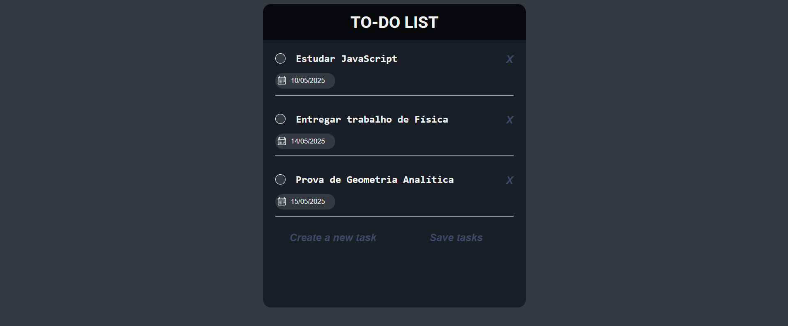

# 📝 To-Do List

Um simples gerenciador de tarefas desenvolvido com **HTML**, **CSS** e **JavaScript**, com funcionalidades para criar, salvar e excluir tarefas, além de armazenamento local via **localStorage**.

## 📷 Preview



---

## 🚀 Funcionalidades

- Adicionar novas tarefas
- Marcar tarefas como concluídas
- Editar títulos das tarefas
- Definir data de término
- Excluir tarefas individualmente
- Salvamento automático das tarefas no navegador (localStorage)

## 🛠️ Tecnologias Utilizadas

- HTML5
- CSS3
- JavaScript (Vanilla JS)
- localStorage

## 💾 Armazenamento

- HTML5
- CSS3
- JavaScript (Vanilla JS)
- localStorage

## 💾 Armazenamento

As tarefas são salvas no localStorage do navegador como um objeto JSON contendo:

```json
{
  "list1": [
    {
      "tittle": "Nome da tarefa",
      "endDate": "dd/mm/yyyy",
      "status": false
    }
  ]
}
```

## 📌 Observações

- O campo de data aceita apenas o formato dd/mm/yyyy.
- Se o título da tarefa estiver vazio ao sair do campo, a tarefa será automaticamente removida.
- A aplicação funciona offline, pois todo o armazenamento é feito localmente.

